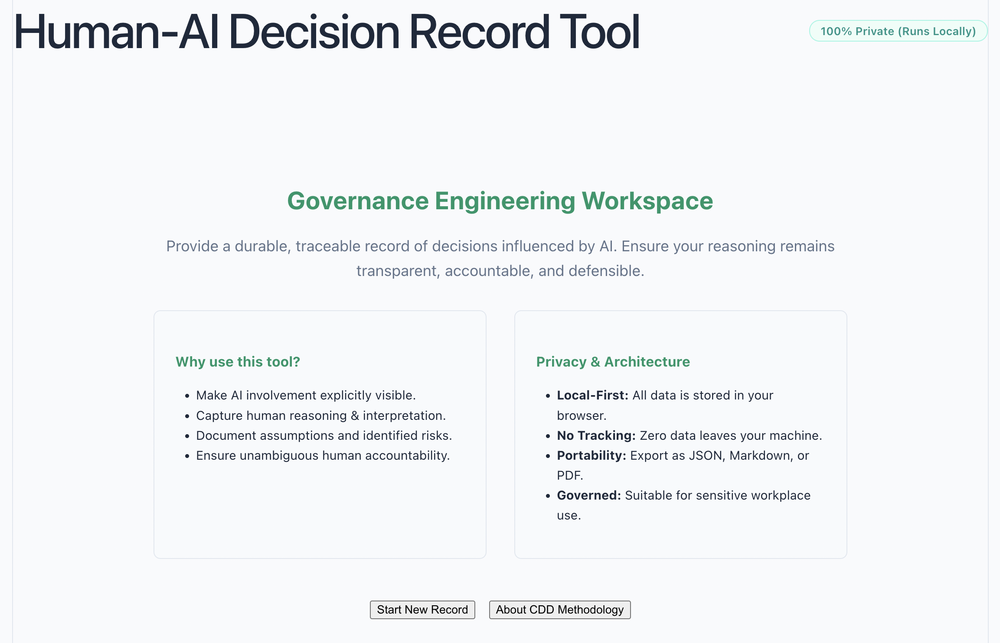

# CloudPedagogy Human-AI Decision Record Tool


## Overview
A static, local-first web application designed as a governance instrument for recording, reviewing, and auditing decisions influenced by AI.

This application belongs to the Human-AI Governance Engineering area of the CloudPedagogy ecosystem. It serves as a proof-of-concept for Capability-Driven Development (CDD), demonstrating how software can be designed to intrinsically support transparent, accountable, traceable, and defensible human-AI decision-making.

## Why it Exists
When AI is used in professional workflows, a common governance problem arises: there is often no durable record of how the AI influenced an outcome. AI involvement becomes invisible, human responsibility is blurred, assumptions remain hidden, risks are poorly documented, and review becomes difficult.

This tool solves that problem by producing a **Human-AI Decision Record**.

## Who is it For
Professionals, individuals, and organizations who need to ensure their AI-supported decisions remain transparent, traceable, accountable, and defensible.

---
## 🌐 Live Hosted Version

👉 http://cloudpedagogy-human-ai-decision-record.s3-website.eu-west-2.amazonaws.com/

---
## 🖼️ Screenshot




---
## 🛠️ Getting Started

### Clone the repository

```bash
git clone [repository-url]
cd [repository-folder]
```

### Install dependencies

```bash
npm install
```

### Run locally

```bash
npm run dev
```

Once running, your terminal will display a local URL (often http://localhost:5173). Open this in your browser to use the application.

### Build for production

```bash
npm run build
```

The production build will be generated in the `dist/` directory and can be deployed to any static hosting service.

---

## 🔐 Privacy & Security

- **Fully local**: All data remains in the user's browser  
- **No backend**: No external API calls or database storage  
- **Privacy-preserving**: No tracking or data exfiltration  
- Suitable for use in sensitive organisational and governance contexts  

---
## Relation to Human-AI Governance Engineering & CDD
This tool is a concrete application within the domain of Human-AI Governance Engineering. It visibly operationalizes the principle that "decisions influenced by AI should remain transparent, traceable, and accountable."

Unlike typical AI capabilities, which focus on developing human competence, this tool is designed entirely through **Capability-Driven Development (CDD)**—a design method that builds systems deeply rooted in capability and governance requirements rather than mere user convenience.

---

## Disclaimer

This repository contains exploratory, framework-aligned tools developed for reflection, learning, and discussion.

These tools are provided **as-is** and are not production systems, audits, or compliance instruments. Outputs are indicative only and should be interpreted in context using professional judgement.

All applications are designed to run locally in the browser. No user data is collected, stored, or transmitted.

---

## Licensing & Scope

This repository contains open-source software released under the MIT License.

CloudPedagogy frameworks and related materials are licensed separately and are not embedded or enforced within this software.

---

## About CloudPedagogy

CloudPedagogy develops open, governance-credible resources for building confident, responsible AI capability across education, research, and public service.

- Website: https://www.cloudpedagogy.com/
- Framework: https://github.com/cloudpedagogy/cloudpedagogy-ai-capability-framework
